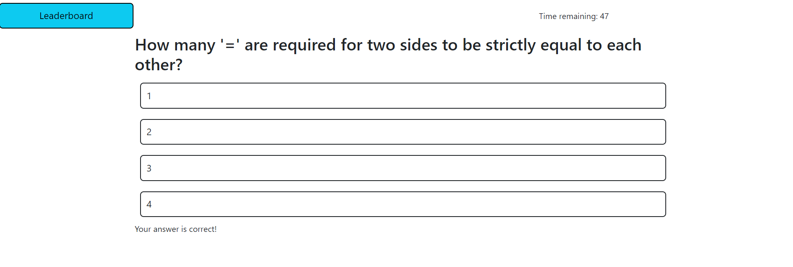
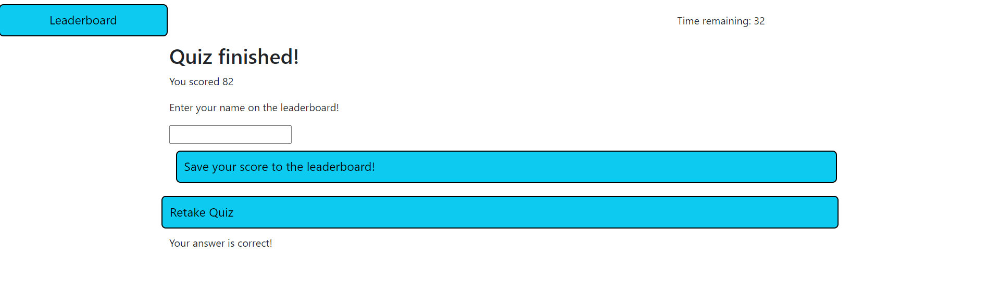
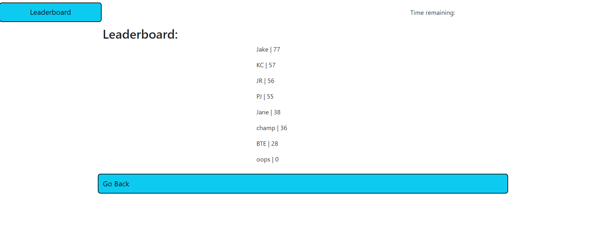

# JavaScript Quiz

## Description

This quiz was built using vanilla JS and Bootstrap.

## Table of Contents

- [JavaScript Quiz](#javascript-quiz)
  - [Description](#description)
  - [Table of Contents](#table-of-contents)
  - [Installation](#installation)
  - [Usage](#usage)
  - [Credits](#credits)
  - [License](#license)
  - [How to Contribute](#how-to-contribute)
  - [Tests](#tests)
  - [Questions](#questions)

## Installation

To install this app, clone this repo.

## Usage

To use this app, go to the deployed link here: https://benmday.github.io/js-quiz/

There are 5 simple questions, and each time an incorrect selection is made the timer will deduct 10 seconds. After the user is complete, their score will be tabulated depending on the time remaining. The user will then be able to save their score to the leaderboard.

    
    
    

  
## Credits
  
Bootstrap - https://getbootstrap.com/
 EdEx Bootcamp

## License

This software is licensed under the MIT license.

---

## How to Contribute

N/A

## Tests

N/A

## Questions

Please forward any and all questions to benjaminmichaelday@gmail.com

GitHub username: benmday
